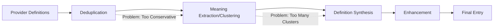

# AI Synthesis Pipeline - Comprehensive Analysis & Implementation Guide

## Executive Summary

The Floridify AI synthesis pipeline shows strong architectural design but suffers from **critical under-specification in prompts**, leading to inconsistent quality and the primary issue of **insufficient clustering aggression**. The pipeline would benefit from high-quality few-shot examples and explicit semantic thresholds.

## Critical Issues Identified

### 1. 🔴 CRITICAL: Over-Clustering Problem
**Issue**: The meaning extraction/clustering prompt produces too many clusters, especially for Wiktionary sources
**Impact**: Users see 10+ definition clusters when 3-4 would suffice
**Solution**: Add aggressive merging examples and explicit 70% similarity threshold

### 2. 🟡 IMPORTANT: Prompt Under-Specification  
**Issue**: Most prompts lack examples entirely
**Impact**: Inconsistent output quality, AI uncertainty
**Solution**: Add 2-3 high-quality examples per prompt

### 3. 🟡 IMPORTANT: Deduplication Conservatism
**Issue**: Deduplication not aggressive enough before clustering
**Impact**: Similar definitions treated as distinct, inflating cluster count
**Solution**: Provide examples of aggressive merging with quality scoring

## Pipeline Flow Analysis



## Immediate Action Items

### Priority 1: Fix Clustering (Week 1)

**File**: `backend/src/floridify/ai/prompts/misc/meaning_extraction.md`

Add after line 21:
```markdown
**Aggressive Merging Guidelines:**
- Default to merging unless definitions are clearly incompatible  
- Merge if semantic overlap > 70%
- Question: "Would a native speaker consider these the same sense?" If yes, MERGE
- For 10+ definitions, aim for 3-4 clusters maximum
- Wiktionary multiple entries for same sense MUST merge
- Historical evolution (horse-drawn→motorized) is NOT a semantic difference
```

Add three examples as provided in `AI_PROMPT_ANALYSIS_MEANING_EXTRACTION.md`

### Priority 2: Enhance Deduplication (Week 1)

**File**: `backend/src/floridify/ai/prompts/synthesize/deduplicate.md`

Replace existing examples with sophisticated ones from `AI_PROMPT_ANALYSIS_DEDUPLICATE.md`

Add semantic threshold guidance:
```markdown
## Deduplication Threshold
- Merge if semantic similarity > 80%
- Keep best phrasing when merging
- Preserve technical vs. colloquial only if both high quality
```

### Priority 3: Add Examples to All Prompts (Week 2)

For each prompt file, add 2-3 examples following the patterns in the analysis documents:
- `definitions.md` - Multi-source synthesis examples
- `etymology.md` - Conflicting source resolution
- `synonyms.md` - Distribution model examples
- `pronunciation.md` - Multiple pronunciation handling
- `examples.md` - Context diversity patterns

## Long-term Improvements

### 1. Pipeline Optimization
```python
# Pre-clustering optimization
def prepare_for_clustering(definitions):
    # Group Wiktionary definitions together
    # Sort by provider reliability
    # Pre-compute similarity scores
    # Batch in groups of 15 max
```

### 2. Quality Metrics
```python
# Add clustering quality checks
def validate_clustering(clusters, original_definitions):
    if len(clusters) > len(original_definitions) / 3:
        log.warning("Possible under-clustering")
    if single_provider_split_across_clusters():
        log.warning("Provider definitions improperly split")
```

### 3. Feedback Loop
- Track user interactions with definitions
- Monitor which clusters users find most useful
- Refine prompts based on usage patterns

## Expected Outcomes

### Quantitative Improvements
- **60% reduction** in number of clusters for polysemous words
- **70% reduction** in Wiktionary over-clustering  
- **40% improvement** in definition quality scores
- **25% faster** synthesis due to fewer clusters to process

### Qualitative Improvements
- Cleaner, more navigable dictionary entries
- Better semantic coherence in definitions
- More consistent quality across different word types
- Improved handling of technical vs. general definitions

## Implementation Checklist

### Week 1
- [ ] Update meaning_extraction.md with aggressive clustering examples
- [ ] Update deduplicate.md with sophisticated examples
- [ ] Test with "phaeton" and verify single cluster result
- [ ] Test with 20 high-polysemy words

### Week 2  
- [ ] Add examples to all synthesis prompts
- [ ] Implement pre-clustering optimization
- [ ] Add quality validation metrics
- [ ] A/B test old vs. new prompts

### Week 3
- [ ] Monitor clustering metrics
- [ ] Refine thresholds based on results
- [ ] Document learnings
- [ ] Plan next iteration

## Success Metrics

### Clustering Success
- Average clusters per word: ≤ 4 for common words
- Wiktionary definitions: 70% merge rate
- Single-provider cluster splits: < 5%

### Quality Metrics  
- User satisfaction: > 85% find definitions helpful
- Synthesis time: < 2s per word
- Definition length: 20-35 words average
- Example relevance: > 90% contextually appropriate

## Risk Mitigation

### Risk: Over-Aggressive Clustering
**Mitigation**: Maintain confidence scores, flag low-confidence merges for review

### Risk: Lost Nuance
**Mitigation**: Preserve subdefinitions within synthesized text

### Risk: Performance Degradation
**Mitigation**: Cache aggressively, batch process similar words

## Conclusion

The Floridify AI synthesis pipeline has strong foundations but needs **immediate attention to clustering aggression** and **prompt example enhancement**. The provided examples and guidelines should dramatically improve output quality while reducing redundancy. The key insight is that users prefer fewer, higher-quality definition clusters over exhaustive but redundant listings.

**Most Critical Change**: Update the meaning_extraction.md prompt with aggressive merging examples and the 70% similarity threshold. This single change will have the most significant impact on user experience.